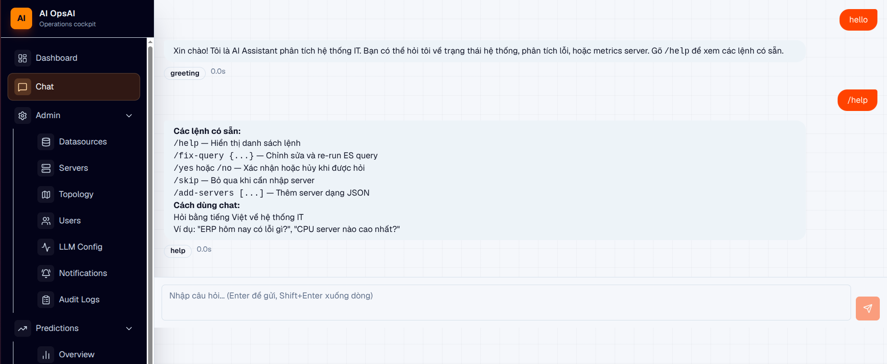
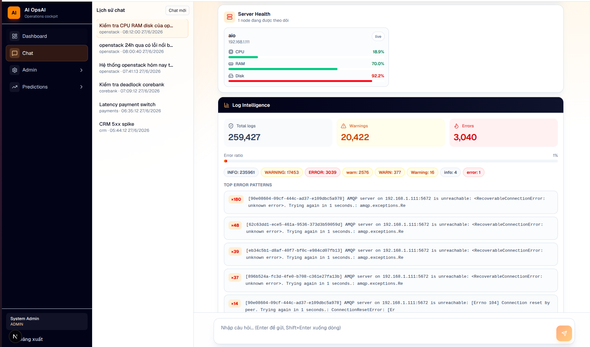
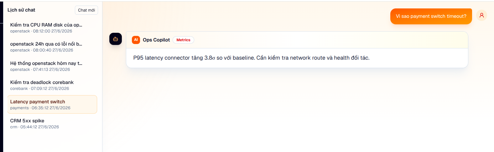
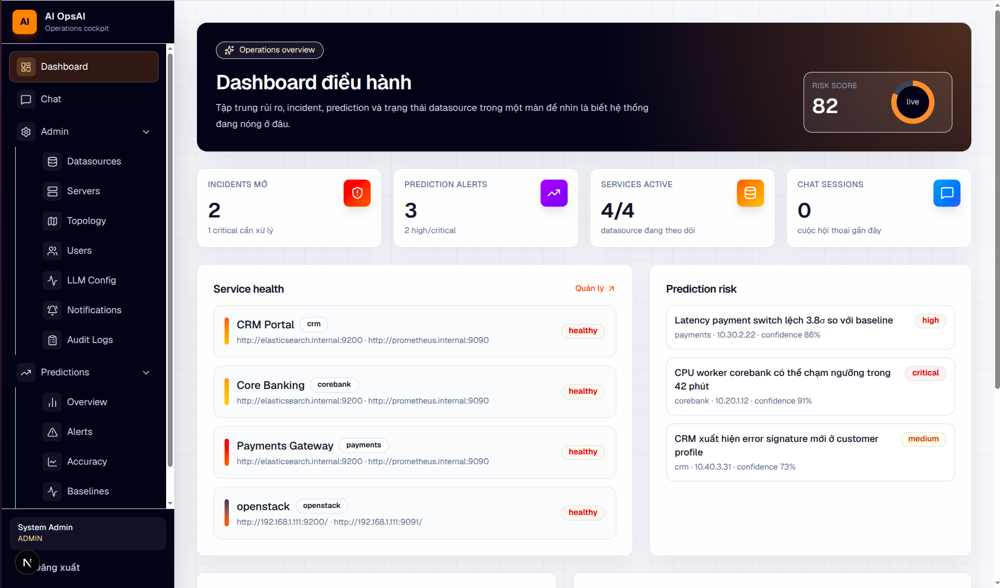
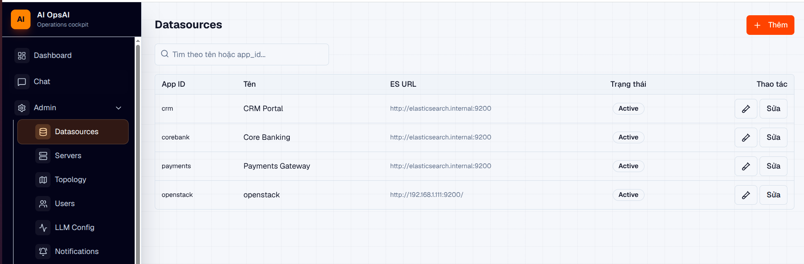
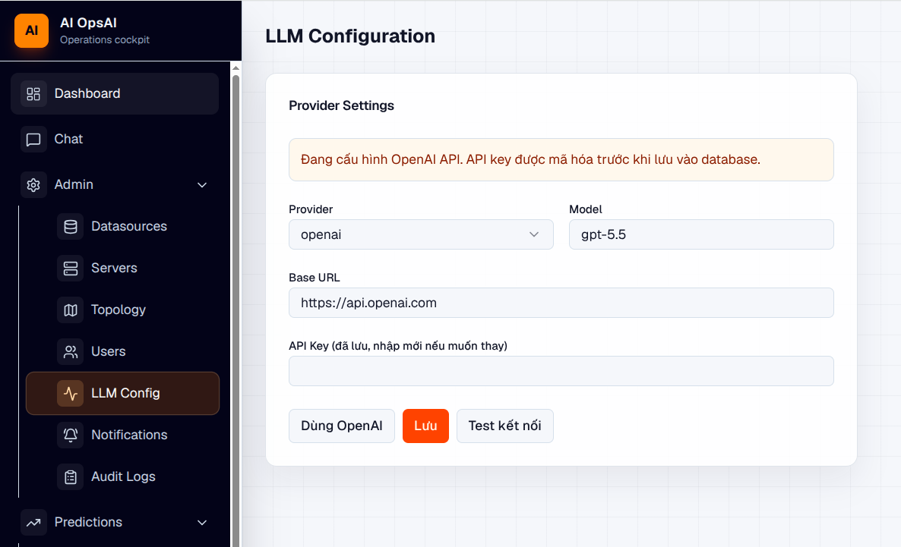
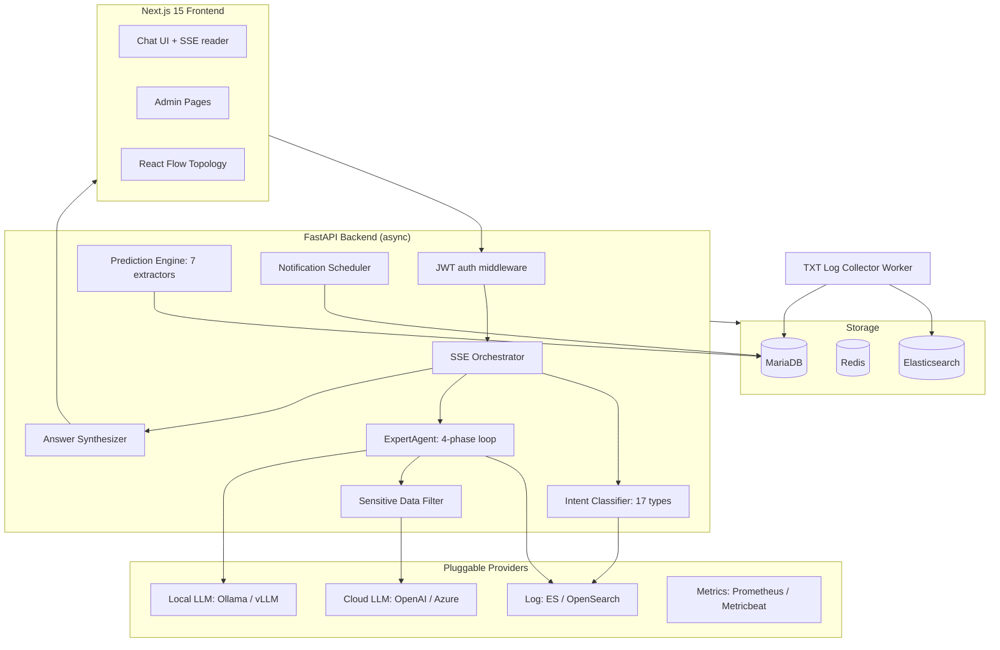
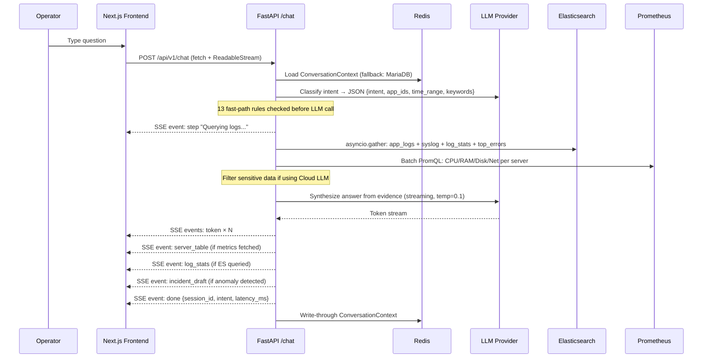

# AIOps: AI Operations Platform

*[Tiếng Việt](README.md) | English*

An AIOps platform for enterprise operations teams. Operators ask questions in natural language, the system classifies intent, queries logs, metrics, incidents, topology and prediction signals in parallel, then streams a grounded answer back — in seconds.

Flexible deployment: run fully on-premise with Ollama/vLLM, or connect to public APIs like OpenAI with a built-in sensitive data filtering layer before anything leaves the network.

## Why AIOps

Operations teams use 5–7 separate tools to handle every incident: Kibana for logs, Grafana for metrics, SSH into servers to check, old emails to find similar incidents, internal wikis for solutions. There is no single place that synthesizes all that context into one answer.

**Problem 1: Long incident resolution time.**
MTTR at most organizations ranges from 45 minutes to several hours — not because tools are lacking, but because context is. Engineers must manually aggregate data from multiple sources before they can even begin reasoning. Every minute of downtime is revenue, reputation and pressure.

**Problem 2: Alert noise destroying focus.**
Thousands of alerts per day — CPU spikes, disk warnings, connection pool exhaustion — but most are noise. The operations team gradually loses the ability to distinguish real signals from false ones. Alert fatigue leads to ignoring alerts, and eventually a real alert gets ignored too.

**Problem 3: Logs and metrics going to waste.**
Terabytes of logs are written every day but 99% are never read. Elasticsearch holds the full context of every incident — error patterns, HTTP traces, slow queries — but no one has time to dig deep enough while the system is on fire.

**Problem 4: No organizational knowledge base.**
A senior engineer resolves an incident in 10 minutes because they have seen it before. A junior spends 3 hours because they have not. When the senior leaves, that knowledge leaves with them — never written down, never transferred.

**Problem 5: Good engineers stuck in repetitive tasks.**
"What's the CPU on ERP right now?" — this question gets asked many times a day, by different people, answered in different ways. The best operations engineers are consumed by manual lookups instead of improving the system.

---

**The solution:** AIOps asks the inverse question — what happens if the system already knows where to look, what context to gather, and how to answer directly?

An operator types a natural-language question. The system classifies intent, queries Logging + Metrics + Topology + Incident history in parallel, synthesizes a grounded answer and streams it back in seconds. If an anomaly is detected, it auto-drafts an incident for the operator to confirm with one click. If the issue has been seen before, it surfaces the solution from last time.

## Technical Highlights

- **Multi-agent pipeline**: 17 intent types, fast-path dispatcher, ExpertAgent 4-phase agentic loop (plan → multi-source fetch → streaming synthesis → causal hypothesis graph)
- **Real-time SSE streaming**: typed event protocol (`step`, `es_query`, `server_table`, `log_stats`, `token`, `incident_draft`, `done`, `error`, `requires_input`) with RAF-batched token flushing on the frontend
- **Pluggable provider layer**: swap LLM backend (Ollama / vLLM / OpenAI / Azure), log storage (Elasticsearch / OpenSearch), metrics (Prometheus / Metricbeat) at runtime without restart
- **Sensitive data filtering before LLM**: when using OpenAI/Azure API, the pipeline automatically strips internal IPs, hostnames, credential patterns and PII from context before sending; only error structure and patterns are sent, never raw values
- **Prediction Engine**: 7 independent signal extractors on APScheduler: OLS capacity forecasting, EWMA baseline deviation, acceleration detection, novel error detection (Jaccard), behavioral drift, composite signals, recurrence matching
- **Conversation state machine**: Redis write-through with MariaDB fallback, slash-command protocol (`/yes`, `/no`, `/add-servers`, `/skip`, `/fix-query`), context preserved across reconnects
- **Full-stack implementation**: FastAPI async backend + Next.js 15 frontend with 20 app routes, React Flow topology editor, real-time chat with history restore
- **No vector database**: Elasticsearch full-text search + Jaccard similarity replaces embedding search entirely; no extra infrastructure, deterministic results, sub-50ms lookups against incident history

## Deployment Modes

AIOps supports two deployment modes, chosen by security requirements and infrastructure:

| | Fully Local | Cloud LLM |
|---|---|---|
| LLM | Ollama / vLLM (runs inside the network) | OpenAI / Azure OpenAI API |
| Data sent outside | None | Filtered error structure only (see below) |
| Hardware requirement | 8-core CPU+ or GPU | No GPU needed |
| Latency | Depends on hardware | Low, consistent |
| Cost | Electricity + hardware only | Pay-per-token |

**Sensitive data filtering layer (when using Cloud LLM):**

Before any context is sent to an external API, the pipeline applies these filters in order:

1. **Remove network identifiers**: internal IPs (RFC 1918: `10.x`, `172.16–31.x`, `192.168.x`), hostnames and server names are replaced with placeholders (`[HOST]`, `[IP]`)
2. **Remove credential patterns**: tokens, API keys and passwords in logs are redacted by regex before entering the prompt
3. **Retain only error structure**: stack traces keep class/method names (needed for analysis), but runtime parameters and values are stripped
4. **Limit log volume**: at most 50 representative log lines are sent, never raw full logs

Result: the cloud LLM receives enough context to analyze error patterns, but receives no information that could identify internal infrastructure.

## Why No Vector Database

Vector databases are the default answer for AI-powered search today — but for operational log systems, they add complexity without proportional benefit.

**Log data is already structured.** Elasticsearch stores log events with `level`, `timestamp`, `host`, `service`, `message` — not unstructured prose. Querying "ERROR logs from ERP in the last 2 hours" is a structured filter + aggregation problem, not a semantic similarity problem. ES already excels at this.

**Incident similarity search does not need embeddings.** `IncidentMatcher` uses Jaccard similarity on tokenized error text. For operational text — dominated by error codes, service names and stack trace keywords — token overlap is a better signal than semantic distance. An incident titled "OOM killer terminated java process on erp-app-01" is correctly matched to similar past incidents via shared tokens (`OOM`, `java`, `erp-app-01`), not via learned semantic proximity.

**Infrastructure cost is real.** A vector DB (Qdrant, Weaviate, Milvus) requires: an embedding model running 24/7, an embedding pipeline for every new log/incident, additional storage, and another service to operate. Every added service is a deployment, monitoring and upgrade burden.

**Comparison:**

| | Vector DB approach | This system |
|---|---|---|
| Infrastructure | ES + embedding model + vector DB | ES only (already exists) |
| Incident search latency | 200–500ms (embed query + ANN search) | < 50ms (Jaccard on last 50 rows) |
| Log querying | Semantic → ES hybrid | Pure ES DSL (aggregations, filters) |
| Determinism | Non-deterministic (model version dependent) | Deterministic (same tokens = same result) |
| Debuggability | Black box (why did this match?) | Transparent (token intersection visible) |
| Embedding drift | Re-index on model upgrade | N/A |

Result: the knowledge base grows and becomes searchable with zero embedding infrastructure, incident similarity is explainable, and the entire system runs on the ES + MariaDB stack the team already operates.

## Screenshots

| Chat: SSE streaming | Chat: deep analysis |
|---|---|
|  |  |

| Chat: causal hypothesis graph | Dashboard |
|---|---|
|  |  |

| Datasource Configuration | LLM Provider Configuration |
|---|---|
|  |  |

## What Is Implemented

| Component | Status | Notes |
|---|---|---|
| FastAPI async backend | ✅ Complete | Auth, admin, chat, incident, topology, prediction, notification routes |
| Natural-language chat pipeline | ✅ Complete | SSE streaming, 17-intent classifier, parallel ES/Prometheus queries, streaming synthesis, conversation state |
| LLM provider layer | ✅ Complete | Ollama, OpenAI-compatible (vLLM), OpenAI, Azure OpenAI — switch at runtime via Admin UI |
| ExpertAgent (ROOT_CAUSE) | ✅ Complete | 4-phase agentic loop: plan, multi-source fetch, streaming, causal hypothesis graph |
| Sensitive data filtering | ✅ Complete | Redact IPs, hostnames, credentials before sending to Cloud LLM |
| Datasource management | ✅ Complete | Per-app MariaDB config, Redis cache (TTL 60s), AES-256-GCM credential encryption |
| Log and metrics providers | ✅ Complete | Elasticsearch/OpenSearch log storage, Prometheus/Metricbeat metrics — pluggable ABC |
| Server registry | ✅ Complete | IP/hostname lookup, auto-discovery via chat `/add-servers` command |
| Incident management | ✅ Complete | CRUD, timeline, similar incident matching, auto-draft from chat analysis |
| Topology graph | ✅ Complete | Versioned nodes/edges, BFS subgraph expansion, blast-radius calculation |
| Prediction engine | ✅ Complete | 7 signal extractors, adaptive APScheduler, suppression, auto-correlation, explanation |
| Notifications | ✅ Complete | Email (SMTP) + Telegram, APScheduler cron, daily Markdown report |
| TXT log collector worker | ✅ Complete | Directory watcher, per-file offset tracking, rotation detection, bulk ES indexing |
| Next.js 15 frontend | ✅ Complete | 20 app routes: chat SSE UI, dashboard, admin CRUD pages, prediction pages, React Flow topology editor |
| Security model | ✅ Complete | JWT HS256, AES-256-GCM credential encryption, app-level isolation, audit log |

## Architecture




### Key Files

| Component | Path |
|---|---|
| API entrypoint | `services/api/app/main.py` |
| Chat SSE workflow | `services/api/app/orchestrator/workflow.py` |
| Intent classifier | `services/api/app/agents/intent.py` |
| Query executor | `services/api/app/agents/query_executor.py` |
| ExpertAgent | `services/api/app/agents/expert_agent.py` |
| Answer synthesizer | `services/api/app/agents/synthesizer.py` |
| Prediction runner | `services/api/app/prediction/runner.py` |
| Frontend chat | `services/frontend/src/components/chat/ChatWindow.tsx` |
| DB schema | `infra/init-db/01_schema.sql` |
| Dev stack | `infra/docker-compose.dev.yml` |

## AI Pipeline



## ExpertAgent: ROOT_CAUSE Analysis

When intent is `ROOT_CAUSE`, `DEEP_ANALYSIS` or `EXPERT_ANALYSIS`, the ExpertAgent replaces the standard pipeline:

```
Phase 1 - Plan:       LLM generates an investigation plan (JSON tool calls)
Phase 2 - Fetch:      Execute plan steps in parallel: ES queries, Prometheus metrics, topology BFS, incident history
Phase 3 - Stream:     Synthesize findings into a grounded answer with streaming
Phase 4 - Hypothesis: Build causal graph: nodes (services/servers) + edges (propagation paths) + confidence scores
```

Output includes a `hypothesis_graph` SSE event rendered as an interactive diagram in the frontend.

## Prediction Engine

Seven independent signal extractors run on APScheduler (adaptive 60s interval):

| Extractor | Method | Threshold |
|---|---|---|
| Capacity forecasting | OLS linear regression | R² ≥ 0.70, horizon ≤ 72h |
| Baseline deviation | EWMA z-score | warn: 2.5σ, crit: 4.0σ |
| Acceleration | CPU slope | ≥ 20%/h sustained |
| Novel error | Jaccard distance | < 0.30 vs known patterns |
| Behavioral drift | Variance/entropy ratio | ≥ 3.0 |
| Composite signal | Multi-signal correlation | ≥ 2 distinct types |
| Recurrence | Jaccard similarity | > 0.70 vs resolved incidents |

Alerts include auto-generated human-readable explanations, blast-radius BFS from the topology graph, and suppression logic to prevent alert storms.

## Topology Graph

AIOps maintains a versioned directed graph of the entire service landscape. Each node is a service, server or database; each edge carries a `propagation_prob` (0.0–1.0) encoding how likely a failure propagates from source to target.

```
topology_versions (1)
    ├── topology_nodes: node_key, label, node_type, health_status, ip, hostname
    └── topology_edges: source→target, relation_type, propagation_prob, weight
```

**How it is built:** Operators draw the graph in the React Flow editor (Admin → Topology). Nodes can be dragged and connected; dagre auto-layout arranges them left-to-right. The editor saves positions and edges back to the API (`PUT /api/v1/topology`). Multiple versions can coexist — only the active version is used at runtime.

**Runtime usage:**

| Consumer | Function |
|---|---|
| ExpertAgent (ROOT_CAUSE) | BFS 2-hop subgraph expansion from the suspected fault node; feeds topology context to the LLM synthesizer |
| Blast Radius calculator | Probabilistic BFS (max 3 hops), prunes paths where cumulative probability < 0.10; used in prediction alerts |
| Prediction alerts | Each alert includes blast radius: downstream services ranked by cumulative impact probability |
| SSE `hypothesis_graph` | ExpertAgent emits the impacted subgraph as an SSE event; rendered as interactive diagram in the frontend |

**Blast radius algorithm:**
```
BFS from origin node:
  for each outgoing edge:
    new_prob = parent_prob × edge.propagation_prob
    if new_prob ≥ 0.10 → add to impact list, continue BFS
  max depth: 3 hops
  output: impacted nodes sorted by cumulative_prob descending
```

**Edge relation types:** `calls`, `depends_on`, `hosts`, `replicates`, `load-balances` — stored in `relation_type`, visible as edge labels in the React Flow editor.

## Knowledge Base: Incident History

The knowledge base is the accumulated incident history stored in MariaDB. When the AI pipeline analyzes a new problem, it searches this history for similar past incidents and surfaces their solutions directly in the answer.

**Schema (relevant fields):**

```sql
incidents (
  id, app_id, title, description, severity, status,
  root_cause,       -- analyst-written root cause
  solution,         -- resolution steps
  error_patterns,   -- JSON array of matched error signatures
  timeline,         -- JSON array of timeline events
  resolved_at
)
```

**Similarity search: `IncidentMatcher`:**

Two search modes run on every root-cause analysis:

| Mode | Algorithm | Scope | Threshold |
|---|---|---|---|
| Title/description match | Jaccard similarity on tokenized text | Last 50 incidents for the same `app_id` | ≥ 0.25 |
| Error pattern match | Jaccard on `error_patterns` JSON field vs current top error messages | Resolved incidents only | ≥ 0.20 |

Results are ranked by similarity score and injected into the LLM synthesizer context — the model is instructed to reference `solution` from similar incidents when available.

**How the knowledge base grows automatically:**

1. Chat analysis detects an anomaly → emits `incident_draft` SSE event
2. Operator confirms → incident created with title, severity, error_patterns, affected servers
3. During investigation, operator adds timeline events and root_cause via UI
4. After resolution, `solution` field is filled → becomes searchable organizational knowledge
5. **Recurrence extractor** in the Prediction Engine scans new error patterns against `error_patterns` of all resolved incidents (Jaccard > 0.70 triggers a recurrence alert)

**Incident lifecycle:**

```
auto-draft (chat)
    → open (operator confirms)
        → investigating (team working)
            → resolved (root_cause + solution filled)
                → knowledge base entry (searchable by future analyses)
```

## Quick Start

**Prerequisites:** Docker + Docker Compose, Ollama (or any OpenAI-compatible LLM endpoint)

```bash
# 1. Clone and configure
cp .env.example .env
# Edit .env: set JWT_SECRET (min 32 chars), ENCRYPTION_KEY (64 hex chars)

# 2. Start the dev stack (MariaDB + Redis + API + Worker + Ollama)
docker compose -f infra/docker-compose.dev.yml up --build

# 3. Pull a local model (skip if using OpenAI/Azure)
docker exec ollama ollama pull qwen2.5:14b

# 4. Verify
curl http://localhost:8000/health
curl http://localhost:8000/ready

# 5. Start the frontend
cd services/frontend && npm install && npm run dev
# → http://localhost:3000
```

Default admin credentials (seeded):
```
username: admin
password: changeme123
```

See the step-by-step guide: [`quick-start.md`](quick-start.md)

## Example Chat Session

```bash
# Get a token
TOKEN=$(curl -s -X POST http://localhost:8000/api/v1/auth/token \
  -H 'Content-Type: application/json' \
  -d '{"username":"admin","password":"changeme123"}' | jq -r .access_token)

# Ask a question — response is SSE stream
curl -N -X POST http://localhost:8000/api/v1/chat \
  -H "Authorization: Bearer $TOKEN" \
  -H 'Content-Type: application/json' \
  -d '{"message": "Are there any critical errors in ERP today?", "app_id": "erp"}'
```

SSE event types returned:

| Event | Payload | When |
|---|---|---|
| `step` | `{text}` | Agent is fetching data |
| `es_query` | `{index, body}` | ES query executed |
| `server_table` | `{servers[]}` | Metrics fetched |
| `log_stats` | `{by_level, top_errors}` | Log aggregation done |
| `token` | `{token}` | LLM streaming token |
| `incident_draft` | `{title, severity, app_id}` | Anomaly detected |
| `hypothesis_graph` | `{nodes, edges}` | ROOT_CAUSE analysis complete |
| `requires_input` | `{form}` | Agent needs server list |
| `done` | `{session_id, intent, latency_ms}` | Complete |
| `error` | `{message}` | Error |

## Security Model

- **Flexible deployment**: run fully local (nothing leaves the network) or use Cloud LLM with mandatory sensitive data filtering
- **JWT HS256** authentication, 8h expiry
- **App-level isolation**: `allowed_apps` in JWT token, enforced at every query
- **AES-256-GCM** encryption for stored datasource credentials (ES API keys, Kibana keys, LLM API keys)
- **Audit log**: every write operation recorded with user, action, entity, IP

## Tech Stack

| Layer | Technology |
|---|---|
| Backend API | Python 3.11 + FastAPI (async) |
| Config database | MariaDB 10.11 |
| Session / Cache | Redis (Sentinel-aware) |
| LLM | Ollama / vLLM / OpenAI / Azure OpenAI |
| Log storage | Elasticsearch 8.9 / OpenSearch |
| Metrics | Prometheus / Metricbeat |
| ORM | SQLAlchemy 2.x async (asyncmy) |
| Migrations | Alembic |
| Task scheduler | APScheduler |
| Frontend | Next.js 15 + App Router + TypeScript |
| UI components | shadcn/ui + Tailwind CSS |
| State management | Zustand + zustand/middleware/persist |
| Graph editor | React Flow + dagre layout |
| Notifications | aiosmtplib (Email) + Telegram Bot API |

## Documentation

- Architecture deep-dive: `docs/01_architecture.md`
- Database schema: `docs/02_database_schema.md`
- API contracts: `docs/03_api_contracts.md`
- Developer guide: `docs/04_dev.md`
- Incident intelligence: `docs/05_incident_intelligence.md`
- ADRs: `docs/04_adr/`

## 17 Intent Types

The intent classifier is the entry point for every question. Each operator message is classified into one of 17 intents before the pipeline decides the processing path, data sources to query, and how to synthesize the answer. 13 fast-path rules are checked first to bypass the LLM call when possible, reducing latency to under 1ms.

### Monitoring: Real-time system health

| Intent | Description | Data sources |
|---|---|---|
| `HEALTH_CHECK` | Overall system health check: service up/down, error rate | ES logs + Prometheus metrics |
| `METRIC_QUERY` | Query specific metrics: CPU, RAM, Disk, Network, connection pool | Prometheus / Metricbeat |
| `ALERT_STATUS` | View status of active, acknowledged or resolved alerts | MariaDB incidents + Prediction alerts |
| `ERROR_LOOKUP` | Search for specific errors by error code, message pattern or time range | Elasticsearch full-text search |

### Analysis: Deep investigation

| Intent | Description | Data sources |
|---|---|---|
| `ROOT_CAUSE` | Root cause analysis: triggers **ExpertAgent** 4-phase loop | ES + Prometheus + Topology BFS + Incident history |
| `INCIDENT_ANALYSIS` | Analyze a specific incident: timeline, affected services, error patterns | MariaDB incidents + ES logs around the time |
| `HTTP_ANALYSIS` | Analyze HTTP request/response: status code distribution, slow endpoints, error paths | ES HTTP access logs |
| `TREND_ANALYSIS` | Analyze trends over time: error growth, metric drift, seasonal patterns | ES aggregation + Prometheus range query |
| `LOG_ANOMALY` | Detect log anomalies: sudden spikes, new patterns appearing, unexpected silence | ES with EWMA baseline comparison |

### Prediction: Forecasting and early warning

| Intent | Description | Data sources |
|---|---|---|
| `CAPACITY_PLANNING` | Forecast when disk/RAM/CPU will hit threshold based on current trends | Prometheus range + OLS regression |

### Security: Security auditing

| Intent | Description | Data sources |
|---|---|---|
| `SECURITY_AUDIT` | Check security logs: failed logins, privilege escalation, suspicious IPs, config changes | ES security logs + audit log |
| `THREAT_MODEL` | Model attack surface from topology: which services are exposed, which paths have high blast radius | Topology graph + Prediction blast radius |

### Operations: System operations

| Intent | Description | Data sources |
|---|---|---|
| `SERVER_QUERY` | Query server information: IP, hostname, running services, aggregated metrics | Server registry + Prometheus |
| `ALERT_MANAGEMENT` | Create, acknowledge, close or adjust alert thresholds | MariaDB incidents + Prediction alerts |
| `PASTE_ALERT` | Operator pastes alert/log/stack trace content directly: system auto-analyzes | Pasted content + ES context lookup |
| `VERIFY_FIX` | Verify that an applied fix actually resolved the issue by comparing metrics/logs before and after | ES + Prometheus with relative time ranges |

### UX: User interaction

| Intent | Description | Data sources |
|---|---|---|
| `CLARIFICATION` | Ambiguous or incomplete question: system asks back to clarify app_id, time range, or context | ConversationContext |

---

> **Classification flow:** Fast-path rules (1ms) → LLM classifier (if no fast-path match) → `post_llm_override()` additional checks → pipeline for the selected intent.

## License

Apache License 2.0 — see [LICENSE](LICENSE).
