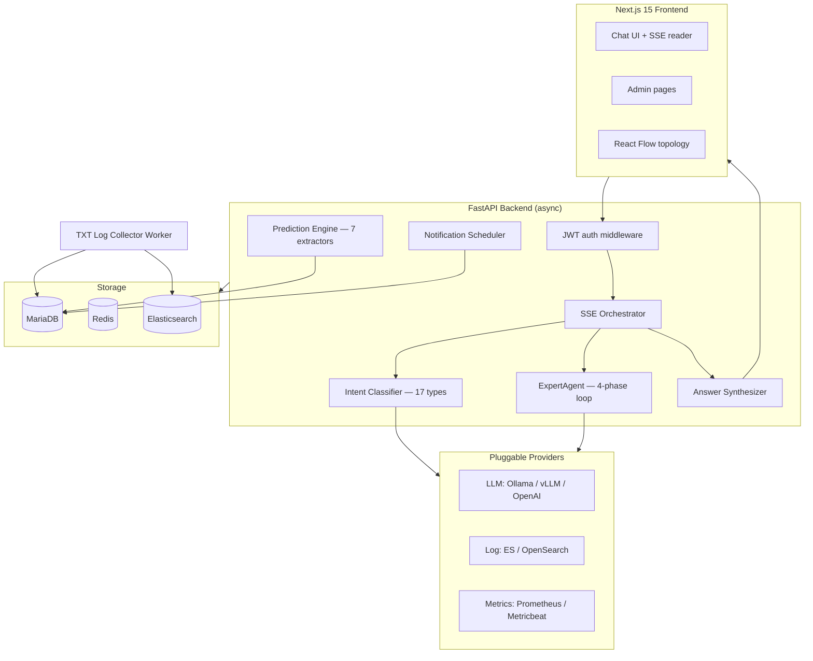
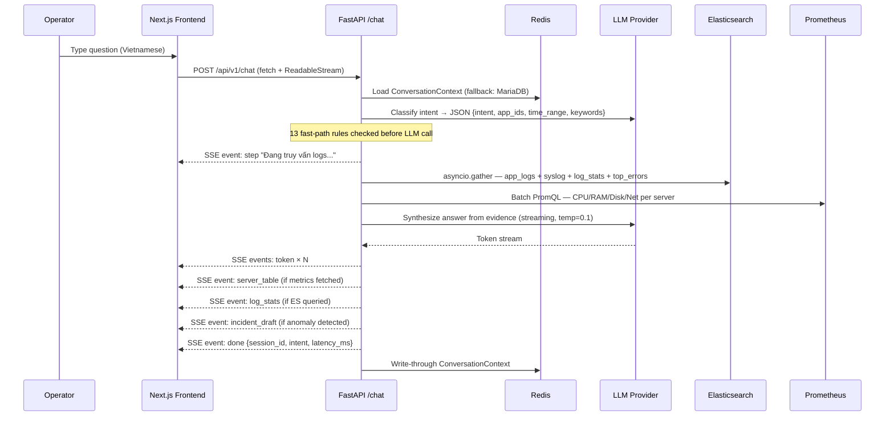

# AIOps — On-Premise AI Operations Platform

An on-premise AIOps platform for enterprise operations teams. Operators ask questions in natural language, the system classifies intent, queries logs, metrics, incidents, topology, and prediction signals in parallel, then streams a grounded answer — all without sending operational data outside the internal network.

Built for Vietnamese enterprise environments where operational data must stay on-premise and LLMs run locally (Ollama / vLLM).

## Why This Exists

Enterprise operators investigate incidents by switching between Kibana, Grafana, SSH sessions, ticket history, and team knowledge. This platform replaces that workflow with a single evidence-grounded chat interface: classify intent → query the right observability backends → stream answer → auto-draft incident if needed.

## Technical Highlights

- **Multi-agent pipeline** — 17 intent types, dedicated fast-path dispatcher, ExpertAgent 4-phase agentic loop (plan → multi-source fetch → streaming synthesis → causal hypothesis graph)
- **Real-time SSE streaming** — typed event protocol (`step`, `es_query`, `server_table`, `log_stats`, `token`, `incident_draft`, `done`, `error`, `requires_input`) with RAF-batched token flushing on the frontend
- **Pluggable provider layer** — swap LLM backend (Ollama / vLLM / OpenAI / Azure), log storage (Elasticsearch / OpenSearch), and metrics (Prometheus / Metricbeat) at runtime without restart
- **Prediction Engine** — 7 independent signal extractors on APScheduler: OLS capacity forecasting, EWMA baseline deviation, acceleration detection, novel error detection (Jaccard), behavioral drift, composite signals, recurrence matching
- **Conversation state machine** — Redis write-through with MariaDB fallback, slash-command protocol (`/yes`, `/no`, `/add-servers`, `/skip`, `/fix-query`), multi-turn context across reconnects
- **Full-stack implementation** — FastAPI async backend + Next.js 15 frontend with 20 app routes, React Flow topology editor, real-time chat with history restore

## What Is Implemented

| Area | Status | Notes |
|---|---|---|
| FastAPI async backend | ✅ Complete | Auth, admin, chat, incident, topology, prediction, notification routes |
| Natural-language chat pipeline | ✅ Complete | SSE streaming, 17-intent LLM classifier, parallel ES/Prometheus query, streaming synthesizer, conversation state |
| LLM provider layer | ✅ Complete | Ollama, OpenAI-compatible (vLLM), OpenAI, Azure OpenAI — runtime switch via admin UI |
| ExpertAgent (ROOT_CAUSE) | ✅ Complete | 4-phase agentic loop: plan, multi-source fetch, stream, causal hypothesis graph |
| Datasource management | ✅ Complete | Per-app MariaDB config, Redis cache (TTL 60s), AES-256-GCM encrypted credentials |
| Log and metric providers | ✅ Complete | Elasticsearch/OpenSearch log storage, Prometheus/Metricbeat metrics — pluggable ABC |
| Server registry | ✅ Complete | IP/hostname lookup, auto-discovery via chat `/add-servers` command |
| Incident management | ✅ Complete | CRUD, timeline, similar incident matching, auto-draft from chat analysis |
| Topology graph | ✅ Complete | Versioned nodes/edges, BFS graph expansion, blast-radius calculation |
| Prediction engine | ✅ Complete | 7 signal extractors, adaptive APScheduler, suppression, auto-correlation, explanation |
| Notifications | ✅ Complete | Email (SMTP) + Telegram channels, APScheduler cron, daily Markdown report |
| TXT log collector worker | ✅ Complete | Directory watcher, per-file offset tracking, rotation detection, bulk ES indexing |
| Next.js 15 frontend | ✅ Complete | 20 app routes: chat SSE UI, dashboard, admin CRUD pages, prediction pages, React Flow topology editor |
| Security model | ✅ Complete | JWT HS256, AES-256-GCM credentials, app-level data isolation, audit log |

## Architecture



### Key Files

| Component | Path |
|---|---|
| API entrypoint | `services/api/app/main.py` |
| Chat SSE workflow | `services/api/app/orchestrator/workflow.py` |
| Intent classifier | `services/api/app/agents/intent.py` |
| Query executor | `services/api/app/agents/query_executor.py` |
| ExpertAgent | `services/api/app/agents/expert_agent.py` |
| Answer synthesizer | `services/api/app/agents/synthesizer.py` |
| Prediction runner | `services/api/app/prediction/runner.py` |
| Frontend chat | `services/frontend/src/components/chat/ChatWindow.tsx` |
| DB schema | `infra/init-db/01_schema.sql` |
| Dev stack | `infra/docker-compose.dev.yml` |

## AI Pipeline



## ExpertAgent — ROOT_CAUSE Analysis

When intent is `ROOT_CAUSE`, `DEEP_ANALYSIS`, or `EXPERT_ANALYSIS`, the ExpertAgent replaces the standard pipeline:

```
Phase 1 — Plan:   LLM generates an investigation plan (JSON tool calls)
Phase 2 — Fetch:  Execute plan steps in parallel: ES queries, Prometheus metrics, topology BFS, incident history
Phase 3 — Stream: Synthesize findings into a grounded answer with streaming
Phase 4 — Hypothesis: Build causal graph — nodes (services/servers) + edges (propagation paths) + confidence scores
```

Output includes a `hypothesis_graph` SSE event rendered as an interactive diagram in the frontend.

## Prediction Engine

Seven independent signal extractors run on APScheduler (adaptive 60s interval):

| Extractor | Method | Threshold |
|---|---|---|
| Capacity forecasting | OLS linear regression | R² ≥ 0.70, horizon ≤ 72h |
| Baseline deviation | EWMA z-score | warn: 2.5σ, crit: 4.0σ |
| Acceleration | CPU slope | ≥ 20%/h sustained |
| Novel error | Jaccard distance | < 0.30 vs known patterns |
| Behavioral drift | Variance/entropy ratio | ≥ 3.0 |
| Composite signal | Multi-signal correlation | ≥ 2 distinct types |
| Recurrence | Jaccard similarity | > 0.70 vs resolved incidents |

Alerts include auto-generated human-readable explanations, blast-radius BFS from topology graph, and suppression logic to prevent alert storms.

## Quick Start

**Prerequisites:** Docker + Docker Compose, Ollama (or any OpenAI-compatible LLM endpoint)

```bash
# 1. Clone and configure
cp .env.example .env
# Edit .env: set JWT_SECRET (min 32 chars), ENCRYPTION_KEY (64 hex chars)

# 2. Start the dev stack (MariaDB + Redis + API + Worker + Ollama)
docker compose -f infra/docker-compose.dev.yml up --build

# 3. Pull a local model
docker exec ollama ollama pull qwen2.5:14b

# 4. Verify
curl http://localhost:8000/health
curl http://localhost:8000/ready

# 5. Start the frontend
cd services/frontend && npm install && npm run dev
# → http://localhost:3000
```

Default admin credentials (seeded):
```
username: admin
password: changeme123
```

## Example Chat Session

```bash
# Get a token
TOKEN=$(curl -s -X POST http://localhost:8000/api/v1/auth/token \
  -H 'Content-Type: application/json' \
  -d '{"username":"admin","password":"changeme123"}' | jq -r .access_token)

# Ask a question — response is SSE stream
curl -N -X POST http://localhost:8000/api/v1/chat \
  -H "Authorization: Bearer $TOKEN" \
  -H 'Content-Type: application/json' \
  -d '{"message": "ERP hôm nay có lỗi nghiêm trọng không?", "app_id": "erp"}'
```

SSE event types returned:

| Event | Payload | When |
|---|---|---|
| `step` | `{text}` | Agent is fetching data |
| `es_query` | `{index, body}` | ES query executed |
| `server_table` | `{servers[]}` | Metrics fetched |
| `log_stats` | `{by_level, top_errors}` | Log aggregation done |
| `token` | `{token}` | LLM streaming token |
| `incident_draft` | `{title, severity, app_id}` | Anomaly detected |
| `hypothesis_graph` | `{nodes, edges}` | ROOT_CAUSE analysis |
| `requires_input` | `{form}` | Agent needs server list |
| `done` | `{session_id, intent, latency_ms}` | Complete |
| `error` | `{message}` | Error |

## Security Model

- **On-premise by design** — no data leaves the internal network; LLM runs locally
- **JWT HS256** authentication, 8h expiry
- **App-level isolation** — `allowed_apps` in JWT token, enforced at every query
- **AES-256-GCM** encryption for stored datasource credentials (ES API keys, Kibana keys, LLM API keys)
- **Audit log** — every write operation recorded with user, action, entity, IP

## Tech Stack

| Layer | Technology |
|---|---|
| Backend API | Python 3.11 + FastAPI (async) |
| Config DB | MariaDB 10.11 |
| Session / Cache | Redis (Sentinel-aware) |
| LLM | Ollama / vLLM (Qwen 2.5 14B default) |
| Log Storage | Elasticsearch 8.9 / OpenSearch |
| Metrics | Prometheus / Metricbeat |
| ORM | SQLAlchemy 2.x async (asyncmy) |
| Migrations | Alembic |
| Task Scheduler | APScheduler |
| Frontend | Next.js 15 + App Router + TypeScript |
| UI Components | shadcn/ui + Tailwind CSS |
| State | Zustand + zustand/middleware/persist |
| Graph editor | React Flow + dagre layout |
| Notifications | aiosmtplib (Email) + Telegram Bot API |

## Documentation

- Architecture deep-dive: `docs/01_architecture.md`
- Database schema: `docs/02_database_schema.md`
- API contracts: `docs/03_api_contracts.md`
- Developer guide: `docs/04_dev.md`
- Incident intelligence: `docs/05_incident_intelligence.md`
- ADRs: `docs/04_adr/`

## License

MIT
