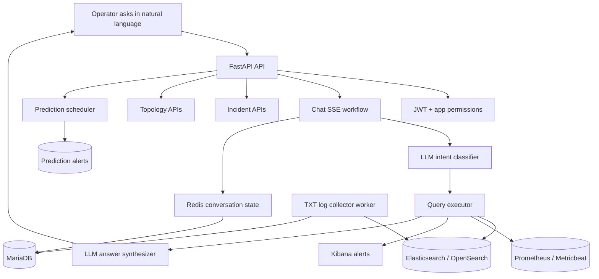
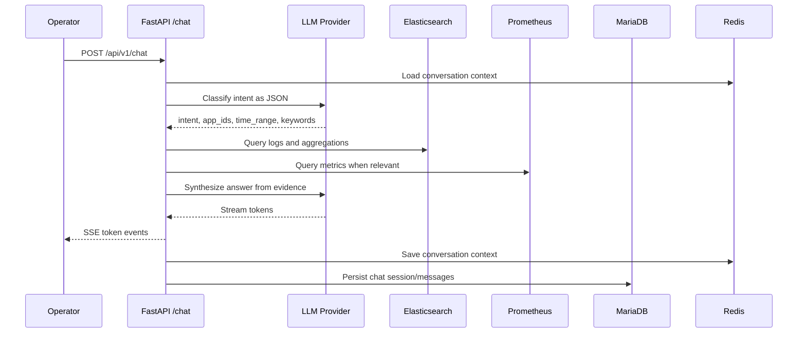

# AIOps

Language-agnostic on-premise AIOps assistant for enterprise operations teams. The platform lets operators ask questions in natural language, routes those questions to logs, metrics, incidents, topology, and prediction signals, then answers in the user's language without sending operational data outside the internal network.

## Why This Matters

Enterprise operators often investigate incidents by switching between Kibana, Grafana, SSH sessions, ticket history, and tribal knowledge. This project turns that workflow into an evidence-grounded chat pipeline: classify the operator intent, query the right observability backends, stream a concise answer, and preserve the investigation as incident intelligence.

## What Is Implemented

| Area | Status | Notes |
|---|---|---|
| FastAPI backend | Implemented | Async API service with health/readiness, auth, admin, chat, incident, topology, and prediction routes. |
| Natural-language chat pipeline | Implemented | SSE streaming, LLM intent classification, ES/Prometheus query execution, answer synthesis, conversation state. |
| LLM providers | Implemented | OpenAI-compatible, Ollama, OpenAI, Azure OpenAI provider modules. |
| Datasource management | Implemented | MariaDB-backed datasource configuration with Redis cache and encrypted credentials. |
| Log and metric providers | Implemented | Elasticsearch/OpenSearch-style log storage and Prometheus/Metricbeat-style metrics abstraction. |
| Incident management | Implemented | CRUD, timeline, similar incident search hooks. |
| Topology APIs | Implemented | Versioned graph nodes/edges, graph expansion, blast-radius API surface. |
| Prediction engine | Implemented foundation | Scheduler, data quality gate, baseline deviation, novelty, recurrence, composite signals, alert writer. |
| TXT log worker | Implemented | Watches configured directories, parses TXT/log files, persists offsets, bulk indexes to Elasticsearch. |
| Frontend | Planned | Documentation references a Next.js UI, but no frontend source is currently present in this repository. |
| Production HA deployment | Planned/partial | Dev Compose exists. Production Nginx/HA Compose is documented as target architecture but not present in the current tree. |

## Architecture



Core entry points:

- API app: `services/api/app/main.py`
- Chat workflow: `services/api/app/orchestrator/workflow.py`
- Intent classifier: `services/api/app/agents/intent.py`
- Query executor: `services/api/app/agents/query_executor.py`
- Answer synthesizer: `services/api/app/agents/synthesizer.py`
- Prediction runner: `services/api/app/prediction/runner.py`
- Worker: `services/worker/app/main.py`
- Dev infrastructure: `infra/docker-compose.dev.yml`
- Database schema: `infra/init-db/01_schema.sql`

## AI Pipeline



The AI is not just a chat wrapper. It is used to classify operational intent, plan or select data access paths, and synthesize answers from real observability evidence.

## Quick Start

Prerequisites:

- Docker and Docker Compose
- A local or reachable LLM endpoint, such as Ollama
- Optional Elasticsearch and Prometheus targets for a real demo

Create an environment file:

```bash
cp .env.example .env
```

Start the development stack:

```bash
docker compose -f infra/docker-compose.dev.yml up --build
```

Check the API:

```bash
curl http://localhost:8000/health
curl http://localhost:8000/ready
```

Default seeded admin user:

```text
username: admin
password: changeme123
```

Log in:

```bash
curl -X POST http://localhost:8000/api/v1/auth/token \
  -H 'Content-Type: application/json' \
  -d '{"username":"admin","password":"changeme123"}'
```

Open API docs:

```text
http://localhost:8000/api/docs
```

## Example Chat Request

```bash
curl -N -X POST http://localhost:8000/api/v1/chat \
  -H 'Authorization: Bearer <token>' \
  -H 'Content-Type: application/json' \
  -d '{
    "message": "ERP hôm nay có lỗi nghiêm trọng không?",
    "app_id": "erp"
  }'
```

The response is `text/event-stream` with events such as:

- `step`
- `es_query`
- `server_table`
- `log_stats`
- `token`
- `incident_draft`
- `done`
- `error`
- `requires_input`

## Documentation

- Architecture: `docs/01_architecture.md`
- Database schema: `docs/02_database_schema.md`
- API contracts: `docs/03_api_contracts.md`
- Developer guide: `docs/04_dev.md`
- Incident intelligence: `docs/05_incident_intelligence.md`
- Operator UX gaps: `docs/06_operator_ux_gaps.md`
- ADRs: `docs/04_adr/`
- Build plan: `plan.md`
- Repository enhancement review: `promt.md`

Note: some documentation describes the target architecture. The implementation table above is the current repository status.

## Security Model

- Designed for on-premise deployments.
- Supports local LLMs via Ollama or OpenAI-compatible endpoints such as vLLM.
- JWT HS256 authentication.
- App-level authorization through `user_app_permissions`.
- AES-256-GCM encryption helper for stored datasource credentials.
- Dynamic datasource configuration stored in MariaDB and cached in Redis.

## Prediction Engine

The prediction subsystem runs on a scheduler and scans active datasource configurations. It currently includes:

- Data quality gate
- EWMA baseline updates
- Baseline deviation signals
- Novel error detection
- Recurrence detection from resolved incidents
- Composite signal generation
- Alert persistence and scan history

## Worker

The TXT log collector worker:

- Reads configured `txt_watch_dirs`
- Tracks per-file offsets in MariaDB
- Detects file rotation
- Parses timestamped log blocks
- Classifies known error patterns
- Bulk indexes records to Elasticsearch

## Known Limitations

- No root-level test suite is currently included.
- No CI workflow is currently included.
- No frontend source is currently included.
- No screenshots, demo GIF, or benchmark results are currently included.
- Alembic is configured, but no migration versions are present.
- Production HA deployment files are not present in the current tree.
- Some docs describe planned architecture and should be kept aligned with code before public submission.

## Roadmap

### P0 Before Public Submission

- Add license.
- Add test suite and CI.
- Add reproducible demo with sample logs and curl transcript.
- Add screenshots or terminal recording.
- Align architecture docs with current implementation.
- Add initial Alembic migration.

### P1

- Add benchmark scripts and baseline results.
- Include worker in dev Compose or document separate worker startup.
- Add production deployment reference.
- Add contribution and security policies.
- Add Mermaid diagrams for prediction, worker ingestion, and auth flows.

### P2

- Add frontend or remove frontend claims from public docs.
- Add comparison with Kibana/Grafana-only workflows and commercial AIOps.
- Add research references and evaluation datasets.

## License

No license file is currently included. Add one before presenting this as an open-source project.
