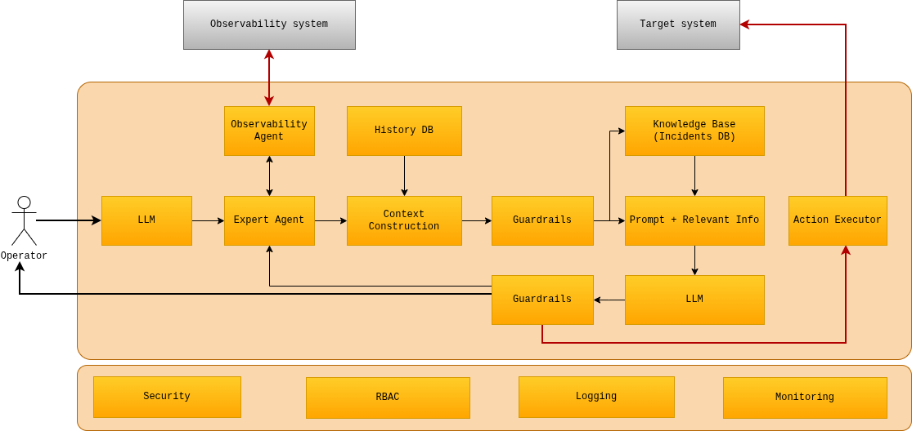
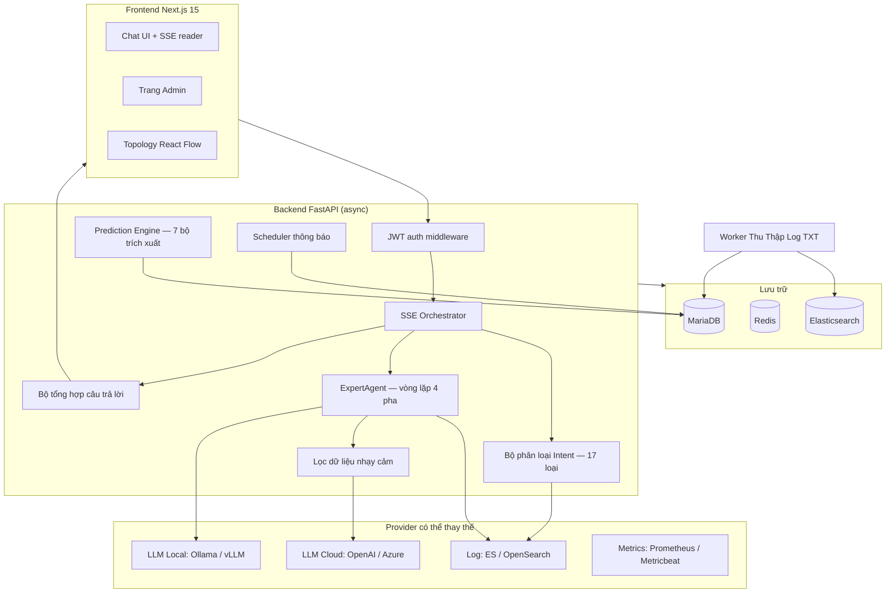
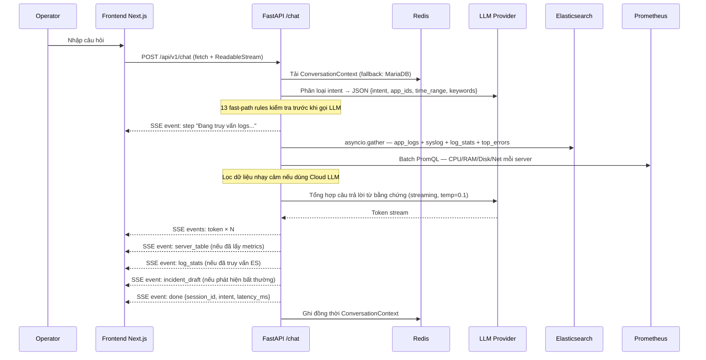

# AIOps — Nền Tảng Vận Hành AI

Nền tảng AIOps dành cho đội vận hành doanh nghiệp. Operator đặt câu hỏi bằng ngôn ngữ tự nhiên, hệ thống phân loại ý định, truy vấn log, metrics, incident, topology và tín hiệu dự đoán song song, rồi stream câu trả lời có dẫn chứng về — trong vài giây.

Hỗ trợ triển khai linh hoạt: chạy hoàn toàn on-premise với Ollama/vLLM, hoặc kết nối OpenAI/Azure API với lớp lọc dữ liệu nhạy cảm tích hợp sẵn trước khi gửi ra ngoài.

## Vì Sao Cần AIOps

Đội vận hành đang dùng 5–7 công cụ riêng lẻ để xử lý mỗi sự cố: Kibana tra log, Grafana xem metrics, SSH vào server kiểm tra, email cũ tìm incident tương tự, wiki nội bộ tìm giải pháp. Không có một nơi nào tổng hợp tất cả ngữ cảnh đó lại thành một câu trả lời.

**Vấn đề 1 — Thời gian xử lý sự cố kéo dài.**
MTTR của hầu hết doanh nghiệp dao động từ 45 phút đến vài giờ, không phải vì thiếu tool mà vì thiếu ngữ cảnh. Engineer phải tự tổng hợp dữ liệu từ nhiều nguồn rồi mới bắt đầu suy luận. Mỗi phút downtime là doanh thu, uy tín và áp lực.

**Vấn đề 2 — Cảnh báo rác gây mất tập trung.**
Hàng nghìn alert mỗi ngày — CPU spike, disk warning, connection pool — nhưng phần lớn là nhiễu. Đội vận hành dần mất khả năng phân biệt tín hiệu thật với tín hiệu giả. Alert fatigue dẫn đến bỏ qua cảnh báo, và rồi đến ngày cảnh báo thật cũng bị bỏ qua theo.

**Vấn đề 3 — Log và metrics bị lãng phí.**
Terabyte log được ghi mỗi ngày nhưng 99% chưa bao giờ được đọc. Elasticsearch đang lưu toàn bộ ngữ cảnh của mỗi sự cố — error pattern, HTTP trace, slow query — nhưng không ai có thời gian đào bới đủ sâu trong lúc hệ thống đang có vấn đề.

**Vấn đề 4 — Thiếu kho tri thức tổ chức.**
Senior engineer giải quyết được sự cố trong 10 phút vì đã gặp trường hợp tương tự nhiều lần. Junior mất 3 tiếng vì không có thông tin đó. Khi senior nghỉ việc, kiến thức biến mất cùng họ — không được ghi lại, không được chuyển giao.

**Vấn đề 5 — Nhân sự giỏi bị mắc kẹt trong tác vụ lặp lại.**
"CPU của ERP đang bao nhiêu?" — câu hỏi này được hỏi nhiều lần mỗi ngày, bởi nhiều người khác nhau, trả lời theo nhiều cách khác nhau. Đội vận hành giỏi nhất bị tiêu hao vào những tác vụ tra cứu thủ công thay vì tập trung cải thiện hệ thống.

---

**Giải pháp:** AIOps đặt câu hỏi ngược lại — điều gì xảy ra nếu hệ thống tự biết phải tra cứu ở đâu, tổng hợp ngữ cảnh nào, và trả lời trực tiếp?

Operator gõ một câu hỏi tự nhiên. Hệ thống phân loại ý định, truy vấn Logging + Metrics + topology + lịch sử incident song song, tổng hợp câu trả lời có dẫn chứng và stream trực tiếp về trong vài giây. Nếu phát hiện bất thường, tự động soạn thảo incident để operator xác nhận một click. Nếu là sự cố đã gặp trước đây, hiển thị giải pháp từ lần trước.

## Điểm Nổi Bật Kỹ Thuật

- **Pipeline đa agent** — 17 loại intent, fast-path dispatcher, vòng lặp agentic 4 pha của ExpertAgent (lập kế hoạch → thu thập đa nguồn → tổng hợp streaming → đồ thị giả thuyết nhân quả)
- **SSE streaming thời gian thực** — giao thức sự kiện có kiểu (`step`, `es_query`, `server_table`, `log_stats`, `token`, `incident_draft`, `done`, `error`, `requires_input`) với RAF-batched token flushing trên frontend
- **Lớp provider có thể thay thế** — đổi LLM backend (Ollama / vLLM / OpenAI / Azure), log storage (Elasticsearch / OpenSearch), metrics (Prometheus / Metricbeat) khi đang chạy, không cần restart
- **Lọc dữ liệu nhạy cảm trước khi gửi LLM** — khi dùng OpenAI/Azure API, pipeline tự động loại bỏ IP nội bộ, hostname, credential pattern và PII khỏi ngữ cảnh trước khi gửi ra ngoài; chỉ gửi cấu trúc lỗi và pattern, không gửi giá trị thực
- **Prediction Engine** — 7 bộ trích xuất tín hiệu độc lập trên APScheduler: dự báo dung lượng OLS, phát hiện lệch baseline EWMA, phát hiện tăng tốc, phát hiện lỗi mới (Jaccard), trôi dạt hành vi, tín hiệu tổ hợp, phát hiện lặp lại
- **Máy trạng thái hội thoại** — ghi đồng thời Redis + fallback MariaDB, giao thức slash-command (`/yes`, `/no`, `/add-servers`, `/skip`, `/fix-query`), duy trì ngữ cảnh qua nhiều lần kết nối lại
- **Full-stack hoàn chỉnh** — backend FastAPI async + frontend Next.js 15 với 20 app route, editor topology React Flow, chat thời gian thực với khôi phục lịch sử
- **Không dùng vector database** — tìm kiếm full-text Elasticsearch + Jaccard similarity thay thế hoàn toàn embedding search; không cần hạ tầng bổ sung, kết quả xác định, truy vấn dưới 50ms trên lịch sử incident

## Chế Độ Triển Khai

AIOps hỗ trợ hai chế độ triển khai, chọn theo yêu cầu bảo mật và hạ tầng:

| | Fully Local | Cloud LLM |
|---|---|---|
| LLM | Ollama / vLLM (chạy trong mạng nội bộ) | OpenAI / Azure OpenAI API |
| Dữ liệu gửi ra ngoài | Không có | Chỉ cấu trúc lỗi đã lọc (xem bên dưới) |
| Yêu cầu phần cứng | CPU 8 core+ hoặc GPU | Không cần GPU |
| Độ trễ | Phụ thuộc phần cứng | Thấp, ổn định |
| Chi phí | Chỉ điện + phần cứng | Pay-per-token |

**Lớp lọc dữ liệu nhạy cảm (khi dùng Cloud LLM):**

Trước khi gửi bất kỳ ngữ cảnh nào ra API bên ngoài, pipeline áp dụng các bước lọc theo thứ tự:

1. **Loại bỏ định danh mạng** — IP nội bộ (RFC 1918: `10.x`, `172.16–31.x`, `192.168.x`), hostname, tên máy chủ được thay bằng placeholder (`[HOST]`, `[IP]`)
2. **Loại bỏ credential pattern** — token, API key, password trong log được redact bằng regex trước khi đưa vào prompt
3. **Chỉ giữ cấu trúc lỗi** — stack trace giữ nguyên class/method name (cần cho phân tích), nhưng tham số và giá trị runtime bị loại bỏ
4. **Giới hạn số dòng log** — tối đa 50 dòng log đại diện được gửi, không gửi toàn bộ log thô

Kết quả: LLM cloud nhận đủ ngữ cảnh để phân tích pattern lỗi, nhưng không nhận thông tin có thể định danh hạ tầng nội bộ.

## Tại Sao Không Dùng Vector Database

Vector database là câu trả lời mặc định cho tìm kiếm AI ngày nay — nhưng với hệ thống log vận hành, chúng thêm độ phức tạp mà không mang lại lợi ích tương xứng.

**Dữ liệu log đã có cấu trúc.** Elasticsearch lưu log event với `level`, `timestamp`, `host`, `service`, `message` — không phải văn xuôi tự do. Truy vấn "log ERROR của ERP trong 2 giờ qua" là bài toán filter + aggregation có cấu trúc, không phải bài toán tương đồng ngữ nghĩa. ES đã làm tốt điều này.

**Tìm kiếm incident tương tự không cần embedding.** `IncidentMatcher` dùng Jaccard similarity trên văn bản lỗi đã tokenize. Với văn bản vận hành — vốn bao gồm chủ yếu là mã lỗi, tên service, từ khóa stack trace — độ trùng lặp token là tín hiệu tốt hơn khoảng cách ngữ nghĩa. Incident "OOM killer terminated java process on erp-app-01" được khớp đúng với các incident tương tự trong quá khứ nhờ các token chung (`OOM`, `java`, `erp-app-01`), không phải nhờ độ gần ngữ nghĩa được học.

**Chi phí hạ tầng là thực tế.** Một vector DB (Qdrant, Weaviate, Milvus) đòi hỏi: embedding model chạy 24/7, pipeline embedding cho mỗi log/incident mới, lưu trữ bổ sung, và thêm một dịch vụ cần vận hành. Mỗi dịch vụ thêm vào là gánh nặng triển khai, giám sát và nâng cấp.

**So sánh:**

| | Phương án Vector DB | Hệ thống này |
|---|---|---|
| Hạ tầng | ES + embedding model + vector DB | Chỉ ES (đã có sẵn) |
| Độ trễ tìm kiếm incident | 200–500ms (embed query + ANN search) | < 50ms (Jaccard trên 50 dòng gần nhất) |
| Truy vấn log | Semantic → ES hybrid | Thuần ES DSL (aggregation, filter) |
| Tính xác định | Không xác định (phụ thuộc phiên bản model) | Xác định (cùng token = cùng kết quả) |
| Khả năng debug | Hộp đen (tại sao lại khớp?) | Minh bạch (thấy được giao token) |
| Embedding drift | Phải re-index khi nâng cấp model | Không áp dụng |

Kết quả: kho tri thức tăng trưởng và tìm kiếm được mà không cần hạ tầng embedding, độ tương đồng incident có thể giải thích được, và toàn bộ hệ thống chạy trên stack ES + MariaDB mà đội vận hành đã quen thuộc.

## Những Gì Đã Được Triển Khai

| Thành phần | Trạng thái | Ghi chú |
|---|---|---|
| Backend FastAPI async | ✅ Hoàn thành | Auth, admin, chat, incident, topology, prediction, notification routes |
| Pipeline chat ngôn ngữ tự nhiên | ✅ Hoàn thành | SSE streaming, bộ phân loại 17 intent, truy vấn ES/Prometheus song song, tổng hợp streaming, trạng thái hội thoại |
| Lớp LLM provider | ✅ Hoàn thành | Ollama, OpenAI-compatible (vLLM), OpenAI, Azure OpenAI — đổi runtime qua Admin UI |
| ExpertAgent (ROOT_CAUSE) | ✅ Hoàn thành | Vòng lặp agentic 4 pha: lập kế hoạch, thu thập đa nguồn, streaming, đồ thị giả thuyết nhân quả |
| Lọc dữ liệu nhạy cảm | ✅ Hoàn thành | Redact IP, hostname, credential trước khi gửi Cloud LLM |
| Quản lý datasource | ✅ Hoàn thành | Config MariaDB theo app, Redis cache (TTL 60s), mã hóa thông tin xác thực AES-256-GCM |
| Provider log và metrics | ✅ Hoàn thành | Log Elasticsearch/OpenSearch, metrics Prometheus/Metricbeat — pluggable ABC |
| Registry server | ✅ Hoàn thành | Tra cứu IP/hostname, tự phát hiện qua lệnh chat `/add-servers` |
| Quản lý incident | ✅ Hoàn thành | CRUD, timeline, khớp incident tương tự, tự soạn thảo từ phân tích chat |
| Đồ thị topology | ✅ Hoàn thành | Nodes/edges có phiên bản, mở rộng BFS, tính toán blast-radius |
| Prediction engine | ✅ Hoàn thành | 7 bộ trích xuất tín hiệu, APScheduler thích nghi, chặn lọc, tự tương quan, giải thích |
| Thông báo | ✅ Hoàn thành | Email (SMTP) + Telegram, cron APScheduler, báo cáo Markdown hàng ngày |
| Worker thu thập log TXT | ✅ Hoàn thành | Theo dõi thư mục, tracking offset theo file, phát hiện rotation, bulk index ES |
| Frontend Next.js 15 | ✅ Hoàn thành | 20 app route: chat SSE UI, dashboard, trang CRUD admin, trang prediction, editor topology React Flow |
| Mô hình bảo mật | ✅ Hoàn thành | JWT HS256, mã hóa thông tin xác thực AES-256-GCM, cô lập theo app, audit log |

## Kiến Trúc





### Các File Quan Trọng

| Thành phần | Đường dẫn |
|---|---|
| Điểm vào API | `services/api/app/main.py` |
| Luồng chat SSE | `services/api/app/orchestrator/workflow.py` |
| Bộ phân loại intent | `services/api/app/agents/intent.py` |
| Bộ thực thi truy vấn | `services/api/app/agents/query_executor.py` |
| ExpertAgent | `services/api/app/agents/expert_agent.py` |
| Bộ tổng hợp câu trả lời | `services/api/app/agents/synthesizer.py` |
| Prediction runner | `services/api/app/prediction/runner.py` |
| Chat frontend | `services/frontend/src/components/chat/ChatWindow.tsx` |
| Schema DB | `infra/init-db/01_schema.sql` |
| Stack dev | `infra/docker-compose.dev.yml` |

## Pipeline AI



## ExpertAgent — Phân Tích ROOT_CAUSE

Khi intent là `ROOT_CAUSE`, `DEEP_ANALYSIS` hoặc `EXPERT_ANALYSIS`, ExpertAgent thay thế pipeline thông thường:

```
Pha 1 — Lập kế hoạch:  LLM tạo kế hoạch điều tra (JSON tool calls)
Pha 2 — Thu thập:      Thực thi các bước kế hoạch song song: truy vấn ES, metrics Prometheus, BFS topology, lịch sử incident
Pha 3 — Streaming:     Tổng hợp kết quả thành câu trả lời có dẫn chứng với streaming
Pha 4 — Giả thuyết:   Xây đồ thị nhân quả — nodes (service/server) + edges (đường lan truyền) + điểm tin cậy
```

Kết quả bao gồm SSE event `hypothesis_graph` được render thành sơ đồ tương tác trên frontend.

## Prediction Engine

Bảy bộ trích xuất tín hiệu độc lập chạy trên APScheduler (chu kỳ thích nghi 60s):

| Bộ trích xuất | Phương pháp | Ngưỡng |
|---|---|---|
| Dự báo dung lượng | Hồi quy tuyến tính OLS | R² ≥ 0.70, chân trời ≤ 72h |
| Lệch baseline | EWMA z-score | cảnh báo: 2.5σ, nguy kịch: 4.0σ |
| Tăng tốc | Độ dốc CPU | ≥ 20%/h liên tục |
| Lỗi mới | Khoảng cách Jaccard | < 0.30 so với pattern đã biết |
| Trôi dạt hành vi | Tỉ lệ variance/entropy | ≥ 3.0 |
| Tín hiệu tổ hợp | Tương quan đa tín hiệu | ≥ 2 loại khác biệt |
| Lặp lại | Jaccard similarity | > 0.70 so với incident đã giải quyết |

Các alert bao gồm giải thích tự động bằng ngôn ngữ tự nhiên, BFS blast-radius từ đồ thị topology, và logic chặn lọc để ngăn bão cảnh báo.

## Đồ Thị Topology

AIOps duy trì đồ thị có hướng có phiên bản của toàn bộ hạ tầng dịch vụ. Mỗi node là một service, server hoặc database; mỗi edge mang `propagation_prob` (0.0–1.0) mã hóa khả năng lỗi lan truyền từ nguồn đến đích.

```
topology_versions (1)
    ├── topology_nodes  — node_key, label, node_type, health_status, ip, hostname
    └── topology_edges  — source→target, relation_type, propagation_prob, weight
```

**Cách xây dựng:** Operator vẽ đồ thị trong editor React Flow (Admin → Topology). Có thể kéo thả nodes và kết nối edges; dagre auto-layout sắp xếp từ trái sang phải. Editor lưu vị trí và edges về API (`PUT /api/v1/topology`). Nhiều phiên bản có thể cùng tồn tại — chỉ phiên bản active được dùng khi chạy.

**Cách sử dụng khi chạy:**

| Thành phần | Chức năng |
|---|---|
| ExpertAgent (ROOT_CAUSE) | Mở rộng BFS 2-hop từ node lỗi nghi ngờ — cung cấp ngữ cảnh topology cho LLM synthesizer |
| Tính toán Blast Radius | BFS xác suất (tối đa 3 hop), loại bỏ đường có xác suất tích lũy < 0.10 — dùng trong prediction alerts |
| Prediction alerts | Mỗi alert bao gồm blast radius: các service downstream xếp hạng theo xác suất tác động tích lũy |
| SSE `hypothesis_graph` | ExpertAgent phát event SSE subgraph bị ảnh hưởng — render thành sơ đồ tương tác trên frontend |

**Thuật toán blast radius:**
```
BFS từ node gốc:
  với mỗi edge đi ra:
    new_prob = xác_suất_cha × edge.propagation_prob
    nếu new_prob ≥ 0.10 → thêm vào danh sách tác động, tiếp tục BFS
  độ sâu tối đa: 3 hop
  kết quả: các node bị ảnh hưởng sắp xếp theo cumulative_prob giảm dần
```

**Loại quan hệ trên edge:** `calls`, `depends_on`, `hosts`, `replicates`, `load-balances` — lưu trong `relation_type`, hiển thị là nhãn edge trong editor React Flow.

## Kho Tri Thức — Lịch Sử Incident

Kho tri thức là lịch sử incident tích lũy lưu trong MariaDB. Khi pipeline AI phân tích một vấn đề mới, nó tìm trong lịch sử này các incident tương tự trong quá khứ và đưa giải pháp trực tiếp vào câu trả lời.

**Schema (các trường quan trọng):**

```sql
incidents (
  id, app_id, title, description, severity, status,
  root_cause,       -- nguyên nhân gốc rễ do analyst viết
  solution,         -- các bước giải quyết
  error_patterns,   -- JSON array chữ ký lỗi đã khớp
  timeline,         -- JSON array sự kiện timeline
  resolved_at
)
```

**Tìm kiếm tương đồng — `IncidentMatcher`:**

Hai chế độ tìm kiếm chạy trên mỗi phân tích nguyên nhân gốc rễ:

| Chế độ | Thuật toán | Phạm vi | Ngưỡng |
|---|---|---|---|
| Khớp tiêu đề/mô tả | Jaccard similarity trên văn bản tokenize | 50 incident gần nhất cùng `app_id` | ≥ 0.25 |
| Khớp pattern lỗi | Jaccard trên trường `error_patterns` JSON so với top error message hiện tại | Chỉ incident đã giải quyết | ≥ 0.20 |

Kết quả được xếp hạng theo điểm tương đồng và đưa vào ngữ cảnh LLM synthesizer — model được hướng dẫn tham chiếu `solution` từ incident tương tự khi có.

**Kho tri thức tự tăng trưởng như thế nào:**

1. Phân tích chat phát hiện bất thường → phát SSE event `incident_draft`
2. Operator xác nhận → incident được tạo với tiêu đề, mức độ nghiêm trọng, error_patterns, server bị ảnh hưởng
3. Trong quá trình điều tra, operator thêm timeline events và root_cause qua UI
4. Sau khi giải quyết, trường `solution` được điền → trở thành tri thức tổ chức có thể tìm kiếm
5. **Bộ trích xuất recurrence** của Prediction Engine quét pattern lỗi mới so với `error_patterns` của mọi incident đã giải quyết (Jaccard > 0.70 kích hoạt cảnh báo lặp lại)

**Vòng đời incident:**

```
tự soạn thảo (chat)
    → mở (operator xác nhận)
        → đang điều tra (đội đang xử lý)
            → đã giải quyết (điền root_cause + solution)
                → mục trong kho tri thức (tìm kiếm được cho các phân tích tương lai)
```

## Khởi Động Nhanh

**Yêu cầu:** Docker + Docker Compose, Ollama (hoặc bất kỳ LLM endpoint tương thích OpenAI)

```bash
# 1. Clone và cấu hình
cp .env.example .env
# Chỉnh .env: đặt JWT_SECRET (tối thiểu 32 ký tự), ENCRYPTION_KEY (64 ký tự hex)

# 2. Khởi động stack dev (MariaDB + Redis + API + Worker + Ollama)
docker compose -f infra/docker-compose.dev.yml up --build

# 3. Pull model local (bỏ qua nếu dùng OpenAI/Azure)
docker exec ollama ollama pull qwen2.5:14b

# 4. Kiểm tra
curl http://localhost:8000/health
curl http://localhost:8000/ready

# 5. Khởi động frontend
cd services/frontend && npm install && npm run dev
# → http://localhost:3000
```

Tài khoản admin mặc định (đã seed sẵn):
```
username: admin
password: changeme123
```

Xem hướng dẫn chi tiết từng bước: [`quick-start.md`](quick-start.md)

## Ví Dụ Phiên Chat

```bash
# Lấy token
TOKEN=$(curl -s -X POST http://localhost:8000/api/v1/auth/token \
  -H 'Content-Type: application/json' \
  -d '{"username":"admin","password":"changeme123"}' | jq -r .access_token)

# Đặt câu hỏi — response là SSE stream
curl -N -X POST http://localhost:8000/api/v1/chat \
  -H "Authorization: Bearer $TOKEN" \
  -H 'Content-Type: application/json' \
  -d '{"message": "ERP hôm nay có lỗi nghiêm trọng không?", "app_id": "erp"}'
```

Các loại SSE event trả về:

| Event | Payload | Khi nào |
|---|---|---|
| `step` | `{text}` | Agent đang lấy dữ liệu |
| `es_query` | `{index, body}` | Đã thực thi truy vấn ES |
| `server_table` | `{servers[]}` | Đã lấy metrics |
| `log_stats` | `{by_level, top_errors}` | Đã tổng hợp log |
| `token` | `{token}` | Token streaming từ LLM |
| `incident_draft` | `{title, severity, app_id}` | Phát hiện bất thường |
| `hypothesis_graph` | `{nodes, edges}` | Phân tích ROOT_CAUSE |
| `requires_input` | `{form}` | Agent cần danh sách server |
| `done` | `{session_id, intent, latency_ms}` | Hoàn thành |
| `error` | `{message}` | Lỗi |

## Mô Hình Bảo Mật

- **Triển khai linh hoạt** — chạy hoàn toàn local (không có gì rời mạng nội bộ) hoặc dùng Cloud LLM với lớp lọc dữ liệu nhạy cảm bắt buộc
- **JWT HS256** xác thực, hết hạn sau 8h
- **Cô lập theo app** — `allowed_apps` trong JWT token, áp dụng tại mọi truy vấn
- **AES-256-GCM** mã hóa thông tin xác thực datasource được lưu (ES API key, Kibana key, LLM API key)
- **Audit log** — mọi thao tác ghi đều được ghi lại với user, hành động, thực thể, IP

## Tech Stack

| Lớp | Công nghệ |
|---|---|
| Backend API | Python 3.11 + FastAPI (async) |
| Database cấu hình | MariaDB 10.11 |
| Session / Cache | Redis (hỗ trợ Sentinel) |
| LLM | Ollama / vLLM / OpenAI / Azure OpenAI |
| Lưu trữ log | Elasticsearch 8.9 / OpenSearch |
| Metrics | Prometheus / Metricbeat |
| ORM | SQLAlchemy 2.x async (asyncmy) |
| Migration | Alembic |
| Task Scheduler | APScheduler |
| Frontend | Next.js 15 + App Router + TypeScript |
| UI Components | shadcn/ui + Tailwind CSS |
| State management | Zustand + zustand/middleware/persist |
| Editor đồ thị | React Flow + dagre layout |
| Thông báo | aiosmtplib (Email) + Telegram Bot API |

## Tài Liệu

- Kiến trúc chi tiết: `docs/01_architecture.md`
- Schema database: `docs/02_database_schema.md`
- API contracts: `docs/03_api_contracts.md`
- Hướng dẫn phát triển: `docs/04_dev.md`
- Phân tích incident intelligence: `docs/05_incident_intelligence.md`
- ADRs: `docs/04_adr/`

## 17 Loại Intent

Bộ phân loại intent là cổng vào của mọi câu hỏi. Mỗi message từ operator được phân loại vào một trong 17 intent trước khi pipeline quyết định luồng xử lý, nguồn dữ liệu cần truy vấn và cách tổng hợp câu trả lời. 13 fast-path rule được kiểm tra trước để bypass LLM call khi có thể, giảm độ trễ xuống dưới 1ms.

### Monitoring — Giám sát trạng thái thời gian thực

| Intent | Mô tả | Nguồn dữ liệu |
|---|---|---|
| `HEALTH_CHECK` | Kiểm tra tổng quan sức khỏe hệ thống, service up/down, error rate | ES log + Prometheus metrics |
| `METRIC_QUERY` | Truy vấn chỉ số cụ thể: CPU, RAM, Disk, Network, connection pool | Prometheus / Metricbeat |
| `ALERT_STATUS` | Xem trạng thái các cảnh báo đang active, đã acknowledge hoặc đã giải quyết | MariaDB incidents + Prediction alerts |
| `ERROR_LOOKUP` | Tìm kiếm lỗi cụ thể theo mã lỗi, message pattern hoặc khoảng thời gian | Elasticsearch full-text search |

### Analysis — Phân tích chuyên sâu

| Intent | Mô tả | Nguồn dữ liệu |
|---|---|---|
| `ROOT_CAUSE` | Phân tích nguyên nhân gốc rễ sự cố — kích hoạt **ExpertAgent** 4 pha | ES + Prometheus + Topology BFS + Incident history |
| `INCIDENT_ANALYSIS` | Phân tích một incident cụ thể: timeline, service bị ảnh hưởng, pattern lỗi | MariaDB incidents + ES log xung quanh thời điểm |
| `HTTP_ANALYSIS` | Phân tích HTTP request/response: status code phân bố, slow endpoint, error path | ES HTTP access log |
| `TREND_ANALYSIS` | Phân tích xu hướng theo thời gian: tăng trưởng lỗi, drift metrics, seasonal pattern | ES aggregation + Prometheus range query |
| `LOG_ANOMALY` | Phát hiện bất thường trong log: spike đột ngột, pattern mới xuất hiện, im lặng bất thường | ES với EWMA baseline so sánh |

### Prediction — Dự báo và cảnh báo sớm

| Intent | Mô tả | Nguồn dữ liệu |
|---|---|---|
| `CAPACITY_PLANNING` | Dự báo khi nào disk/RAM/CPU chạm ngưỡng dựa trên xu hướng hiện tại | Prometheus range + OLS regression |

### Security — Bảo mật và kiểm toán

| Intent | Mô tả | Nguồn dữ liệu |
|---|---|---|
| `SECURITY_AUDIT` | Kiểm tra log bảo mật: failed login, privilege escalation, suspicious IP, config change | ES security log + audit log |
| `THREAT_MODEL` | Mô hình hóa bề mặt tấn công từ topology: service nào exposed, path nào có blast radius cao | Topology graph + Prediction blast radius |

### Operations — Vận hành hệ thống

| Intent | Mô tả | Nguồn dữ liệu |
|---|---|---|
| `SERVER_QUERY` | Truy vấn thông tin server: IP, hostname, service đang chạy, metrics tổng hợp | Server registry + Prometheus |
| `ALERT_MANAGEMENT` | Tạo, acknowledge, đóng hoặc điều chỉnh ngưỡng cảnh báo | MariaDB incidents + Prediction alerts |
| `PASTE_ALERT` | Operator dán trực tiếp nội dung alert/log/stack trace — hệ thống tự phân tích | Nội dung paste + ES context lookup |
| `VERIFY_FIX` | Xác minh một fix đã được áp dụng thực sự giải quyết vấn đề bằng cách so sánh metrics/log trước và sau | ES + Prometheus với time range tương đối |

### UX — Tương tác người dùng

| Intent | Mô tả | Nguồn dữ liệu |
|---|---|---|
| `CLARIFICATION` | Câu hỏi mơ hồ hoặc thiếu thông tin — hệ thống hỏi lại để làm rõ app_id, time range, hoặc ngữ cảnh | ConversationContext |

---

> **Luồng phân loại:** Fast-path rules (1ms) → LLM classifier (nếu không match fast-path) → `post_llm_override()` kiểm tra thêm → pipeline tương ứng với intent được chọn.

## Giấy Phép

Apache License 2.0 — xem file [LICENSE](LICENSE).
